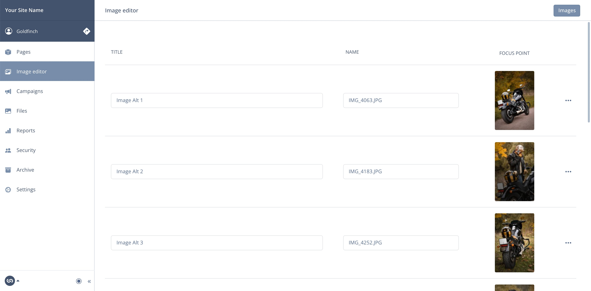
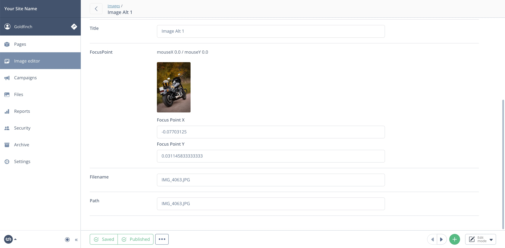

# 🦅 Image Editor for Silverstripe

[](https://packagist.org/packages/goldfinch/image-editor)
[](https://packagist.org/packages/goldfinch/image-editor)
[](https://packagist.org/packages/goldfinch/image-editor)
[](https://packagist.org/packages/goldfinch/image-editor)

Provides a full list of all available images for a quick Alt/Title, Filename and Focus Point update.

Apart from that, it comes with two custom fields: `EditableUploadField`, `EditableSortableUploadField` (based on `UploadField`, `SortableUploadField`) enchanted with an inline editor for quick access and update, without leaving the page or making too many clicks. To more other additions: `ImageCoordsField` and `GridFieldManyManyFocusConfig`.

## Install

```bash
composer require goldfinch/image-editor
```

## Usage

#### Editable UploadField

```php
use SilverStripe\Assets\Image;
use Goldfinch\ImageEditor\Forms\EditableUploadField;

private static $has_one = [
    'Image' => Image::class,
];

private static $owns = [
    'Image',
];

public function getCMSFields()
{
    $fields = parent::getCMSFields();

    $fields->addFieldsToTab(
        'Root.Main',
        [
            // [
            //     TextField::create('Title')
            //     Other fields ...
            // ],
            ...EditableUploadField::create('Image', 'Image', $fields, $this)->getFields(),
            // [
            //     Other fields ...
            // ],
        ]
    );
    
    return $fields;
}
```

#### Editable SortableUploadField

```php
use SilverStripe\Assets\Image;
use Goldfinch\ImageEditor\Forms\EditableSortableUploadField;

private static $many_many = [
    'Images' => Image::class,
];

private static $many_many_extraFields = [
    'Images' => [
        'SortExtra' => 'Int',
    ]
];

private static $owns = [
    'Images',
];

public function getCMSFields()
{
    $fields = parent::getCMSFields();

    $fields->addFieldsToTab(
        'Root.Main',
        [
            // [
            //     TextField::create('Title')
            //     Other fields ...
            // ],
            ...EditableSortableUploadField::create('Images', 'Images', $fields, $this)->getFields(),
            // [
            //     Other fields ...
            // ],
        ]
    );
    
    return $fields;
}
```

#### Editable GridField

```php
use SilverStripe\Assets\Image;
use SilverStripe\Forms\GridField\GridField;
use Goldfinch\ImageEditor\Forms\GridField\GridFieldManyManyFocusConfig;

private static $many_many = [
    'Images' => Image::class,
];

private static $many_many_extraFields = [
    'Images' => [
        'SortOrder' => 'Int',
    ]
];

private static $owns = [
    'Images',
];

public function getCMSFields()
{
    $fields = parent::getCMSFields();

    $fields->addFieldsToTab(
        'Root.Main',
        [
            GridField::create('ImageAttributes', 'Images', $this->Images(), GridFieldManyManyFocusConfig::create()),
        ]
    );

    return $fields;
}
```

#### Editable ImageCoords

```php
use SilverStripe\Assets\Image;
use Goldfinch\ImageEditor\Forms\ImageCoordsField;

private static $has_one = [
    'Image' => Image::class,
];

private static $owns = [
    'Image',
];

public function getCMSFields()
{
    $fields = parent::getCMSFields();

    $fields->addFieldsToTab(
        'Root.Main',
        [
            ImageCoordsField::create($this, 'Image'),
        ]
    );

    return $fields;
}
```
## Previews

#### Image Editor admin

#### Image edit page

#### Editable UploadField

#### Editable SortableUploadField

#### Editable GridField

#### Editable ImageCoords


## References

**Pre-installed packages included in this module**
- [bummzack/sortablefile](https://github.com/bummzack/sortablefile)
- [symbiote/silverstripe-gridfieldextensions](https://github.com/symbiote/silverstripe-gridfieldextensions)
- [stevie-mayhew/hasoneedit](https://github.com/stevie-mayhew/hasoneedit)
- [jonom/focuspoint](https://github.com/jonom/silverstripe-focuspoint)

*and thanks to*

- [jonom/silverstripe-image-coord](https://github.com/jonom/silverstripe-image-coord)
- [seppzzz/silverstripe-image-coord](https://github.com/seppzzz/silverstripe-image-coord)
- [axllent/silverstripe-meta-editor](https://github.com/axllent/silverstripe-meta-editor)

## License

The MIT License (MIT)
